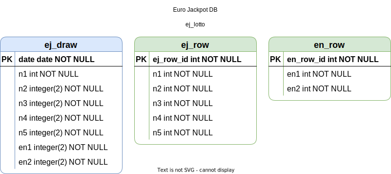

# Lotto - Database Management System

<br><br>

## Data Source for `ej_draw`
[https://www.westlotto.de/service/downloads/downloads.html](https://www.westlotto.de/service/downloads/downloads.html)

<br><br>
## Data Description on `kaggle.com`

- Binomial coefficient

    $$ \binom{n}{k} = \frac{n!}{k! \cdot ( n - k )!}  $$ 


- Faculty arithmetic 

    $$ n! = 1\cdot2\cdot3\cdot4 ... n = \prod_ {k=1}^n{k} $$


- EuroJackpot [Kaggle => 5 from 50](https://www.kaggle.com/code/tonisun/5from50)

$$ \binom{50}{5} = \frac{50!}{5! \cdot ( 50 - 5 )!} = \frac{50!}{5! \cdot 45!} = $$ 

$$ = \frac{1\cdot2\cdot3\cdot .. \cdot 50}{1\cdot2\cdot3\cdot4\cdot5  \cdot  1\cdot2\cdot3\cdot .. \cdot 45} = $$

$$ = \frac{3,0414093201713378043612608166065e+64}{1,4354666503857623347435579379479e+58} = 2.118.760 $$

<br>

$$ \binom{12}{2} = \frac{12!}{2!\cdot(12-2)!} = \frac{12!}{2! \cdot 10!} = $$

$$ = \frac{1\cdot2\cdot3\cdot4\cdot5\cdot6\cdot7\cdot8\cdot9\cdot10\cdot11\cdot12}{1\cdot2\cdot1\cdot2\cdot3\cdot4\cdot5\cdot6\cdot7\cdot8\cdot9\cdot10} = $$

$$ = \frac{479.001.600}{7.257.600} = 66 $$

- Euro Jackpot * 2 EuroNumbers(1..12)

$$ \binom{50}{5} \cdot \binom{12}{2} = 2.118.760 \cdot 66 = 139.838.160$$

- 6 from 49 * 1 SuperZahl(0..9)  

$$ \binom{49}{6} \cdot \binom{10}{1} = 13.983.816  \cdot  10 = 139.838.160 $$

<br><br>
## Data Models Development

- **Entities** - Represent real world object or concept
  - Euro Jackpot Draws ```{ data_base_name: "ej_draw", API_name: "EuroJackpotDraw" }```
  - All Euro Jackpot Rows ```{ data_base_name: "ej_row", API_name: "EuroJackpotRow" }```
  <br>

  - 6 from 49 Draws ```{ ... }```
  - All 6 from 49 Rows ```{ ... }```
  <br>
  
  - ... ```{ ... }```

<br>


- **Attributes** - Furder describe an entity
  - Entity ```ej_draw```

<style>
    table {
        font-size: 12px;
    }
</style>

<table >
    <header>
        <tr>
            <th>desc \ fields</th><th>date</th><th>n1</th><th>n2</th><th>n3</th><th>n4</th><th>n5</th><th>en1</th><th>en2</th>
        </tr>
    </header>
    <body>
         <tr>
            <th>types </th><td>date or <br>varchar(10)</td><td>integer(2)</td><td>integer(2)</td><td>integer(2)</td><td>integer(2)</td><td>integer(2)</td><td>integer(2)</td><td>integer(2)</td>
        </tr>
        <tr>
            <th>constraints </th><td>Primary Key<br> unique <br>{ date..n5 }</td><td>unique { n1..n5 }</td><td>unique { n1..n5 }</td><td>unique { n1..n5 }</td><td>unique { n1..n5 }</td><td>unique { n1..n5 }</td><td>unique { en1, en2 }</td><td>unique { en1, en2 }</td>
        </tr>
        <tr>
            <th>desc </th><td>YYYY-MM-DD</td><td>{ 1..50 }</td><td>{ 1..50 }</td><td>{ 1..50 }</td><td>{ 1..50 }</td><td>{ 1..50 }</td><td>{ 1..12 }</td><td>{ 1..12 }</td>
        </tr>
    </body>
</table>

<br>

- **Attributes** - Furder describe an entity
  - Entity ```ej_row```
    - unique{ n1 < n2 < n3 < n4 < n5 }
    - each row is unique
    - from (1, 2, 3, 4, 5) to (46, 47, 48, 49, 50)
    - each row have unique `row_id`, as unique identification in relations with other entities


<style>
    table {
        font-size: 12px;
    }
</style>

<table >
    <header>
        <tr>
            <th>desc \ fields</th><th>id</th><th>n1</th><th>n2</th><th>n3</th><th>n4</th><th>n5</th>
        </tr>
    </header>
    <body>
         <tr>
            <th>types </th><td>integer(7)</td><td>integer(2)</td><td>integer(2)</td><td>integer(2)</td><td>integer(2)</td><td>integer(2)</td>
        </tr>
        <tr>
            <th>constraints </th><td>Primary Key<br> unique <br>{ 1..2118760 }</td><td>unique { n1..n5 }</td><td>unique { n1..n5 }</td><td>unique { n1..n5 }</td><td>unique { n1..n5 }</td><td>unique { n1..n5 }</td>
        </tr>
        <tr>
            <th>desc </th><td>{ 1..2118760 }</td><td>{ 1..50 }</td><td>{ 1..50 }</td><td>{ 1..50 }</td><td>{ 1..50 }</td><td>{ 1..50 }</td>
        </tr>
    </body>
</table>

<br>

- **Relationships** - Association among 2 or more entities

  - ```ej_draw``` - none yet
  - ```ej_row``` - none yet



<br><br>
## Data Definition for MySQL and PostgreSQL

### Create Database `ej_lotto` on MySQL Server

With the same database name `ej_lotto`, user name `ej_lotto` and password `ej_lotto` on test server ;-)

```shell 
mysql_ej_lotto_001.sql
```

```SQL
-- Database `ej_lotto`
CREATE DATABASE  IF NOT EXISTS `ej_lotto` ;
USE `ej_lotto`;

-- Table `ej_draw`
DROP TABLE IF EXISTS `ej_draw`;
CREATE TABLE `ej_draw` (
  `date` date NOT NULL,
  `n1` int(2) NOT NULL,
  `n2` int(2) NOT NULL,
  `n3` int(2) NOT NULL,
  `n4` int(2) NOT NULL,
  `n5` int(2) NOT NULL,
  `en1` int(2) NOT NULL,
  `en2` int(2) NOT NULL,
  PRIMARY KEY (`date`)
) ENGINE=InnoDB DEFAULT CHARSET=utf8mb4;

-- INSERT TEST
INSERT INTO `ej_draw` (`date`, `n1`, `n2`, `n3`, `n4`, `n5`, `en1`, `en2` VALUES 
(now(), 1, 2, 3, 4, 5, 12, 11);

-- Table `ej_row`
DROP TABLE IF EXISTS `ej_row`;
CREATE TABLE `ej_row` (
  `row_id` int(7) NOT NULL AUTO_INCREMENT,
  `n1` int(2) NOT NULL,
  `n2` int(2) NOT NULL,
  `n3` int(2) NOT NULL,
  `n4` int(2) NOT NULL,
  `n5` int(2) NOT NULL,
  PRIMARY KEY (`row_id`)
) ENGINE=InnoDB AUTO_INCREMENT=1 DEFAULT CHARSET=utf8mb4;

CREATE DEFINER=`root`@`localhost` PROCEDURE `pr_set_ej_all_rows`()

BEGIN

    DECLARE v_from INT DEFAULT 0;
    DECLARE v_n1 INT DEFAULT 0;
    DECLARE v_n2 INT DEFAULT 0;
    DECLARE v_n3 INT DEFAULT 0;
    DECLARE v_n4 INT DEFAULT 0;
    DECLARE v_n5 INT DEFAULT 0;
    
    SET v_from = 50;
    SET v_n1 = 1;

    L1: LOOP
        IF v_n1 <= (v_from - 4) THEN
            SET v_n2 = v_n1 + 1;
            L2: LOOP
                IF v_n2 <= (v_from - 3) THEN
                    SET v_n3 = v_n2 + 1;
                    L3: LOOP
                        IF v_n3 <= (v_from - 2) THEN
                            SET v_n4 = v_n3 + 1;
                            L4: LOOP
                                IF v_n4 <= (v_from - 1) THEN
                                    SET v_n5 = v_n4 + 1;  
                                    L5: LOOP
                                        IF v_n5 <= v_from THEN
                                            INSERT INTO ej_lotto.ej_row (n1, n2, n3, n4, n5) VALUES (v_n1, v_n2, v_n3, v_n4, v_n5);
                                            SET v_n5 = v_n5 + 1;
                                        ELSE
                                            LEAVE L5;
                                        END IF;
                                    END LOOP;
                                    SET v_n4 = v_n4 + 1;
                                ELSE
                                    LEAVE L4;
                                END IF;
                            END LOOP;
                            SET v_n3 = v_n3 + 1;
                        ELSE
                            LEAVE L3;
                        END IF;
                    END LOOP;
                    SET v_n2 = v_n2 + 1;
                ELSE
                    LEAVE L2;
                END IF;
            END LOOP; 
            SET v_n1 = v_n1 + 1;
        ELSE
            LEAVE L1;
        END IF;
    END LOOP;

END

```


### Create Database `ej_lotto` on PostgreSQL Server

With the same database name `ej_lotto`, user name `ej_lotto` and password `ej_lotto` on test server ;-)

```BASH
pgsql_ej_lotto_001.sql
```

```SQL
-- Role: ej_lotto
-- DROP ROLE IF EXISTS ej_lotto;

CREATE ROLE ej_lotto WITH
  LOGIN
  NOSUPERUSER
  INHERIT
  CREATEDB
  NOCREATEROLE
  NOREPLICATION
  ENCRYPTED PASSWORD 'SCRAM-SHA-256$4096:sP+kNtYPyOvs77EOZvGHhA==$Xr8RDnLe0xCrlikHwMe4auwoh681tvfJLOqEsxgHy4I=:crXTLQ59j7V1Q2GYch9Kgee6SishRkV7PASgHJwNN1w=';

-- Database: ej_lotto
-- DROP DATABASE IF EXISTS ej_lotto;

CREATE DATABASE ej_lotto
    WITH 
    OWNER = ej_lotto
    ENCODING = 'UTF8'
    LC_COLLATE = 'German_Germany.1252'
    LC_CTYPE = 'German_Germany.1252'
    TABLESPACE = pg_default
    CONNECTION LIMIT = -1;


-- Table: public.ej_draw
-- DROP TABLE IF EXISTS public.ej_draw;

CREATE TABLE IF NOT EXISTS public.ej_draw (
    date date NOT NULL,
    n1 integer NOT NULL,
    n2 integer NOT NULL,
    n3 integer NOT NULL,
    n4 integer NOT NULL,
    n5 integer NOT NULL,
    en1 integer NOT NULL,
    en2 integer NOT NULL,
    CONSTRAINT ej_draw_pkey PRIMARY KEY (date)
)

ALTER TABLE IF EXISTS public.ej_draw OWNER to ej_lotto;


-- Table: public.ej_row
-- DROP TABLE IF EXISTS public.ej_row;

CREATE TABLE IF NOT EXISTS public.ej_row (
    row_id integer NOT NULL DEFAULT nextval('ej_row_row_id_seq'::regclass),
    n1 integer NOT NULL,
    n2 integer NOT NULL,
    n3 integer NOT NULL,
    n4 integer NOT NULL,
    n5 integer NOT NULL,
    CONSTRAINT ej_row_pkey PRIMARY KEY (row_id)
)

ALTER TABLE IF EXISTS public.ej_row OWNER to ej_lotto;


-- Table: public.en_row
-- DROP TABLE IF EXISTS public.en_row;

CREATE TABLE IF NOT EXISTS public.en_row (
    row_id integer NOT NULL DEFAULT nextval('en_row_row_id_seq'::regclass),
    n1 integer NOT NULL,
    n2 integer NOT NULL,
    CONSTRAINT en_row_pkey PRIMARY KEY (row_id)
)

ALTER TABLE IF EXISTS public.en_row OWNER to ej_lotto;


-- PROCEDURE: public.pr_ej_all_rows()
-- DROP PROCEDURE IF EXISTS public.pr_ej_all_rows();

CREATE OR REPLACE PROCEDURE public.pr_ej_all_rows()
LANGUAGE 'plpgsql'
AS $BODY$
DECLARE
    _from int;
	_n1 int;
	_n2 int;
	_n3 int;
	_n4 int;
	_n5 int;
  BEGIN
  	_from := 50;
	_n1 := 1;
    FOR _n1 IN 1 .. _from - 4 LOOP
		FOR _n2 IN _n1 + 1 .. _from - 3 LOOP
			FOR _n3 IN _n2 + 1 .. _from - 2 LOOP
				FOR _n4 IN _n3 + 1 .. _from - 1 LOOP
					FOR _n5 IN _n4 + 1 .. _from LOOP
						INSERT INTO ej_row (n1, n2, n3, n4, n5) VALUES (_n1, _n2, _n3, _n4, _n5);
					END LOOP;
				END LOOP;
			END LOOP;
		END LOOP;
	END LOOP;
  END;
$BODY$;

ALTER PROCEDURE public.pr_ej_all_rows() OWNER TO ej_lotto;


-- PROCEDURE: public.pr_en_all_rows()
-- DROP PROCEDURE IF EXISTS public.pr_en_all_rows();

CREATE OR REPLACE PROCEDURE public.pr_en_all_rows()
LANGUAGE 'plpgsql'
AS $BODY$
DECLARE
    _from int;
	_n1 int;
	_n2 int;
BEGIN
  	_from := 12;
	_n1 := 1;
    FOR _n1 IN 1 .. _from - 1 LOOP
        FOR _n2 IN _n1 + 1 .. _from LOOP
            INSERT INTO en_row (n1, n2) VALUES (_n1, _n2);			
        END LOOP;
    END LOOP;
END;
$BODY$;
ALTER PROCEDURE public.pr_en_all_rows() OWNER TO ej_lotto;

```
